# Présentation de Wysiwyg cast software

## les différentes fenêtres

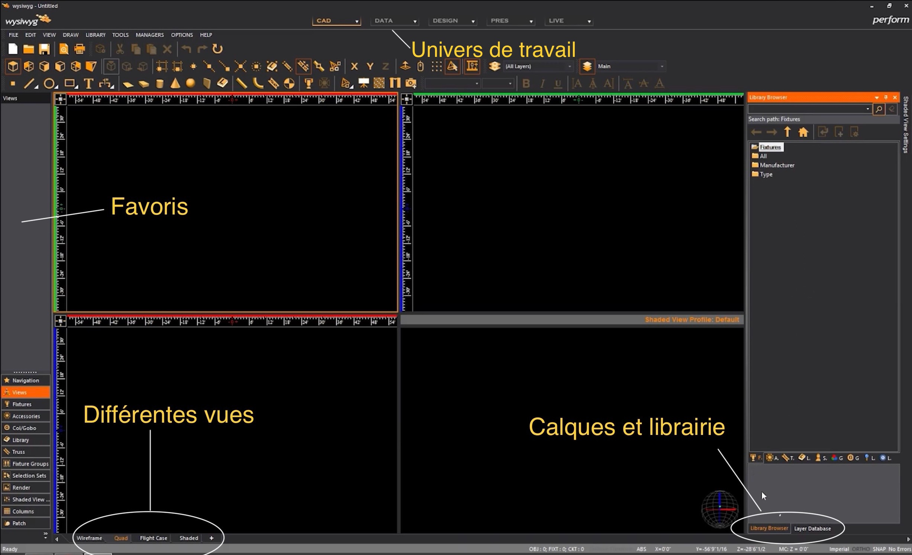

## Enregitrement
Wysiwyg force à enregistrer un projet avec un dossier principal et des sous dossiers. il faut penser à créer un nom de projet, enregistrer à le projet directement

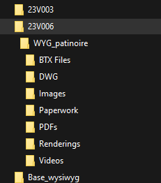

# les barres

pour ajouter une barre

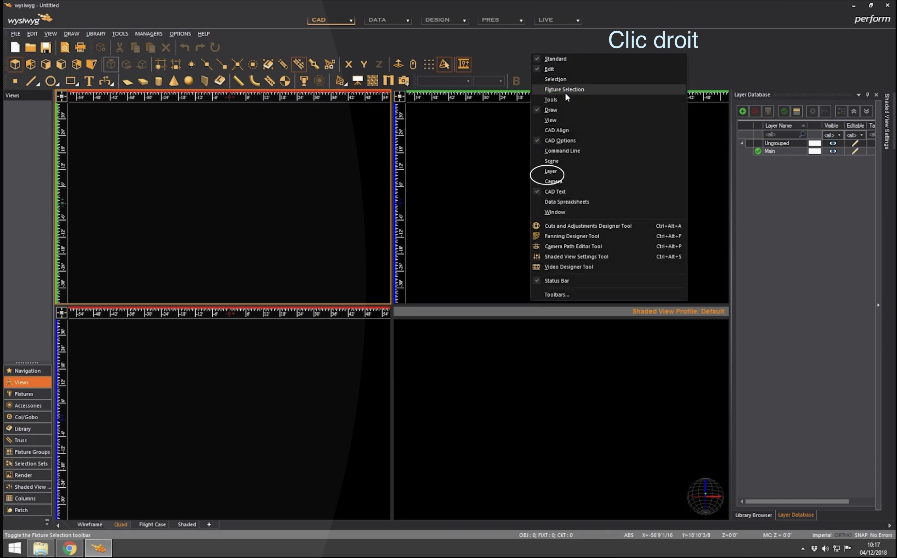
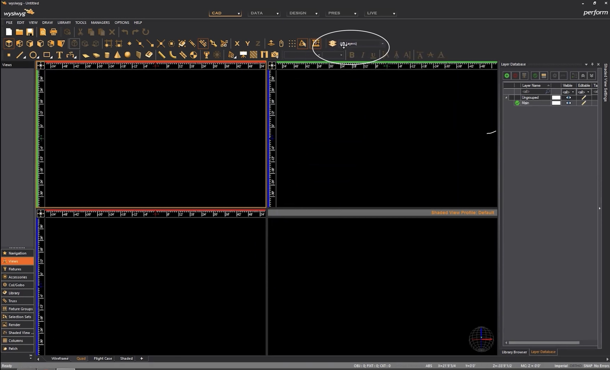

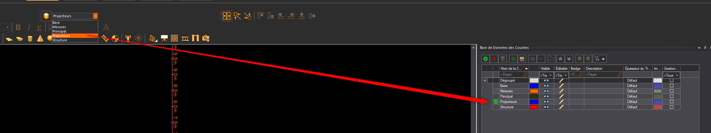

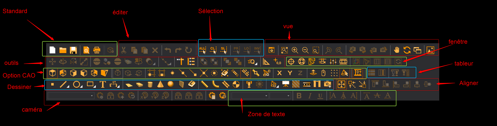

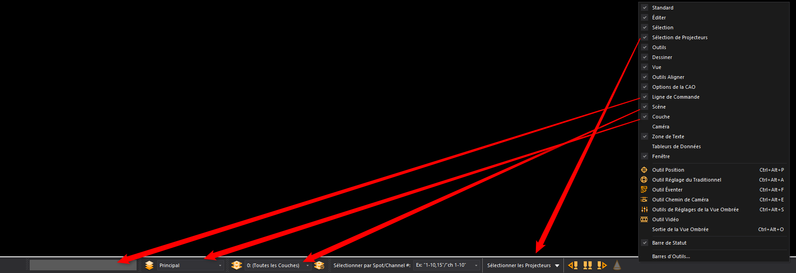

# Changer les unités

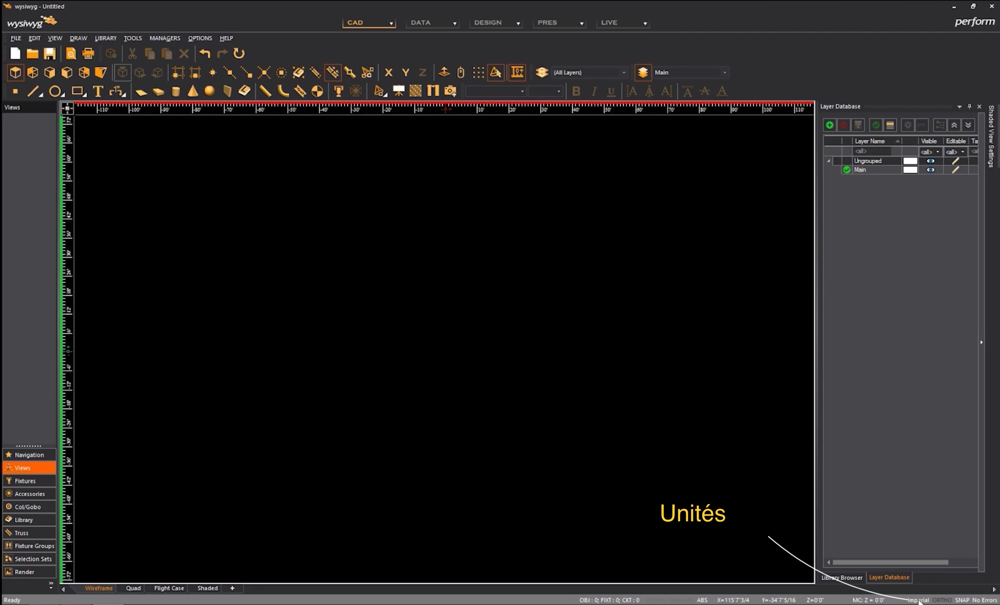
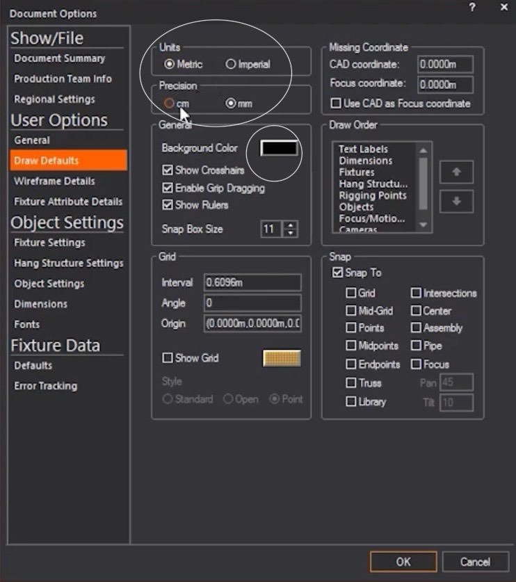

# enregistrer une vue (position et zoom)

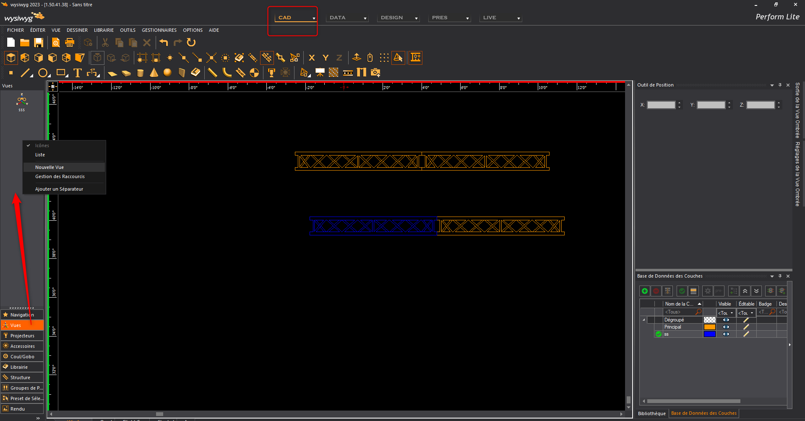

# modifier une vue

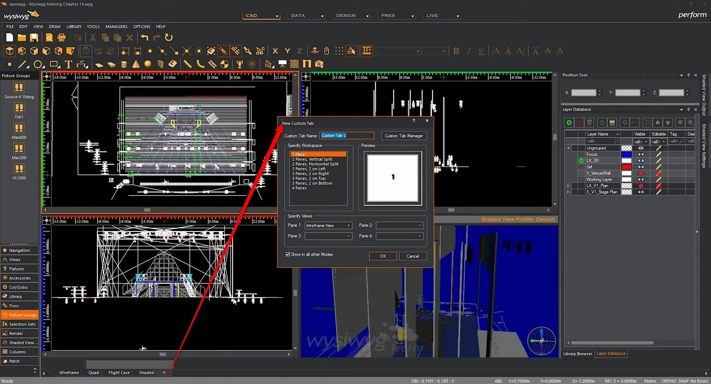
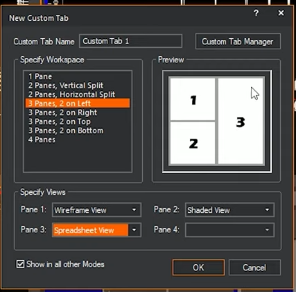

# distribuer les objets

tout sélectionner, distribuate fixture bewteen two points, et cliquez sur les 2 points

**attention ne fonction que pour des projecteurs et de la structure dans le meme sens**

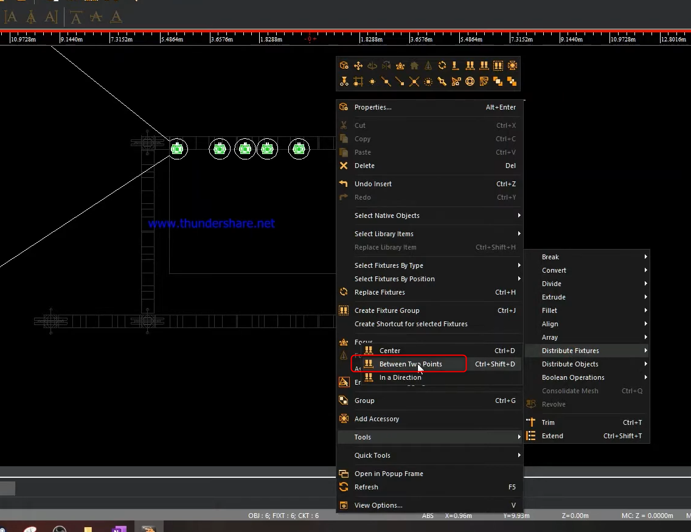
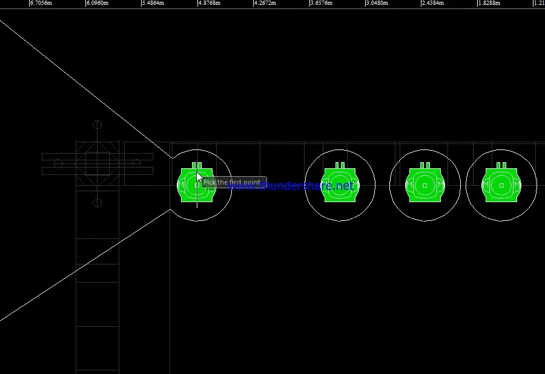
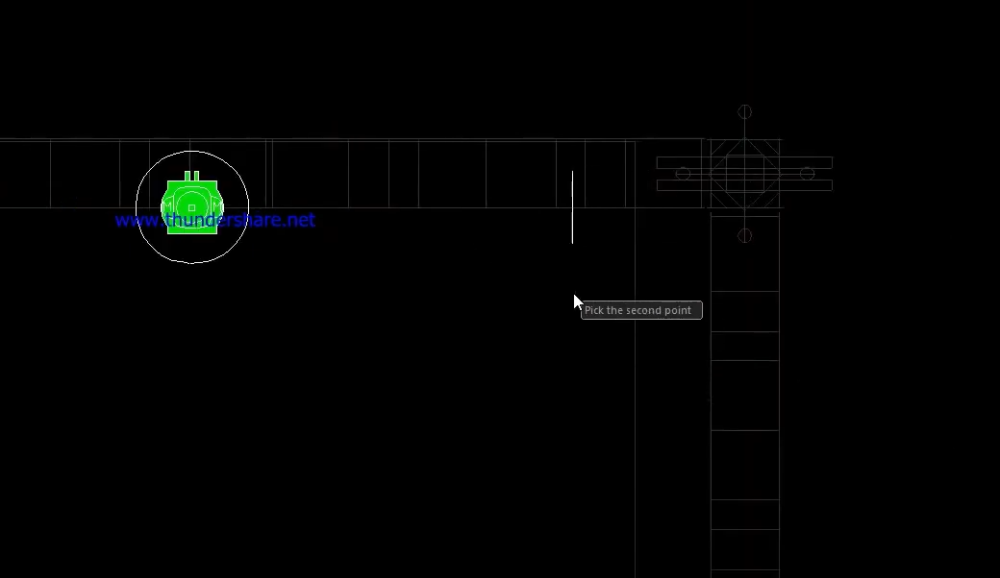

attention pour des lyres au sol, ce ne sont pas des fixtures, mais des objets

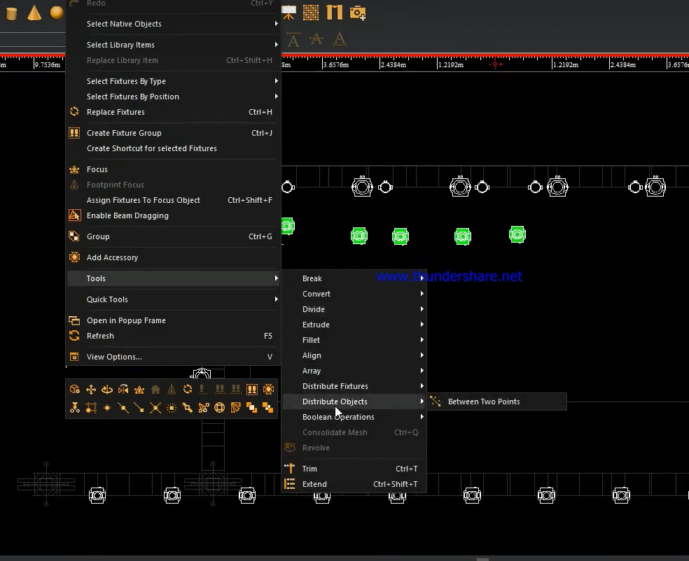

# points à voir
rigging
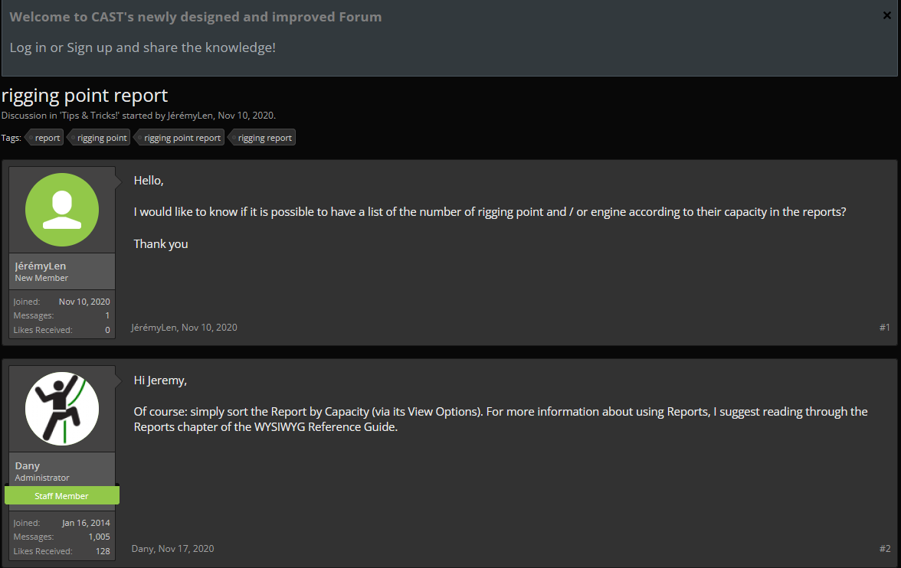

# raccourci

grouper ctrl G
groupe de projo ctrl J
