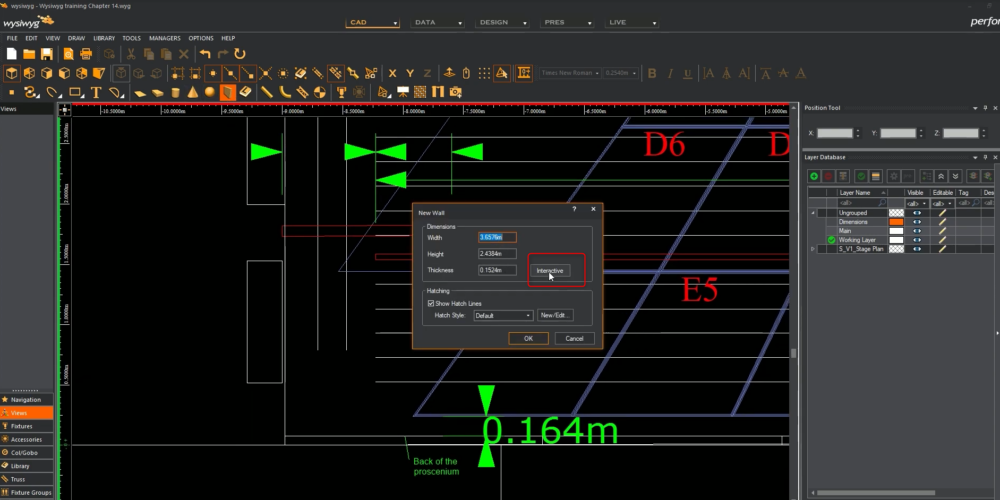
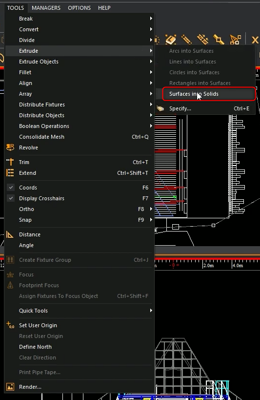

# les formes 3D

## Ajouter un objet 3D

l'option interactive permet de faire une forme à la souris et non en entrant les dimensions à la main

## extruder ou applatir

Dessiner une ligne2

transformer la ligne en surface

extruder

Dessiner une ligne2

extruder directement

choisir le nombre de point

ou

## les boleans

sélectionner l'objet à travailler

## texture

faire la meme chose avec une texture transparente (PNG) mappée sur un wall

## Les rideaux

Clic sur rideau, régler les options

dessiner la forme

Ajouter une texture ou couleur

Ajouter de l'ampleur

ou le mettre en option sur un tube directement

