# Les calques

## Afficher les calques

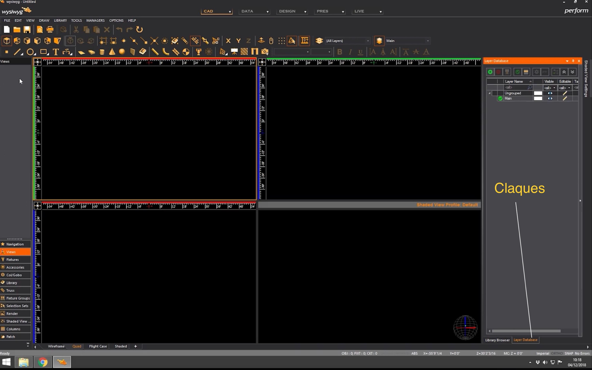

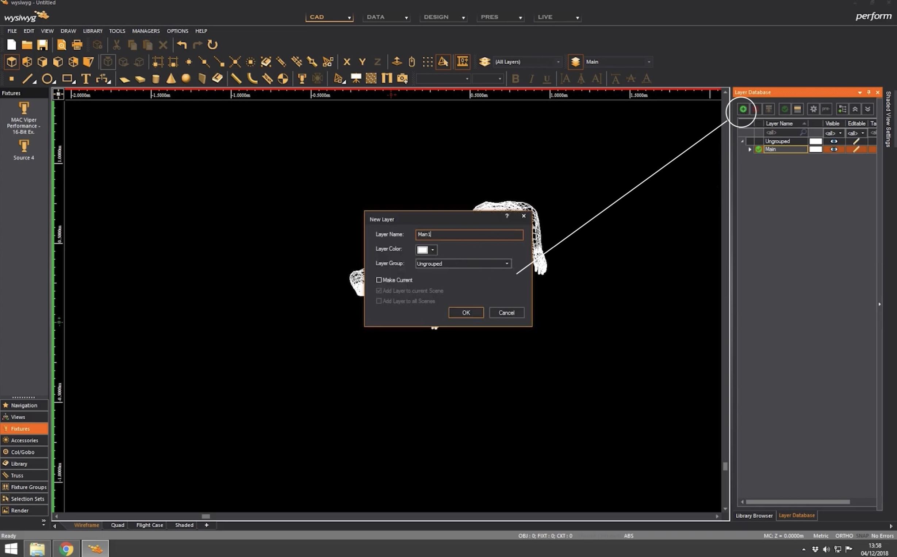

Changer la couleur de la croix pour savoir sur quel calque on travail

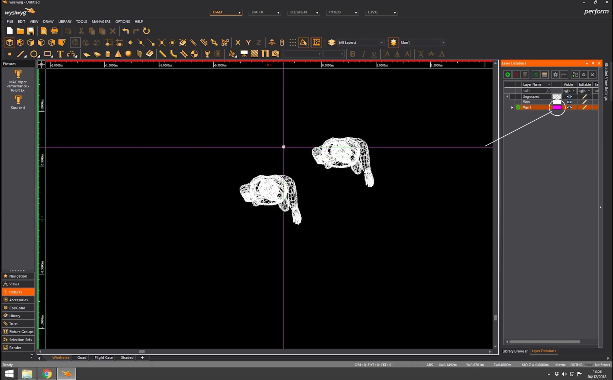
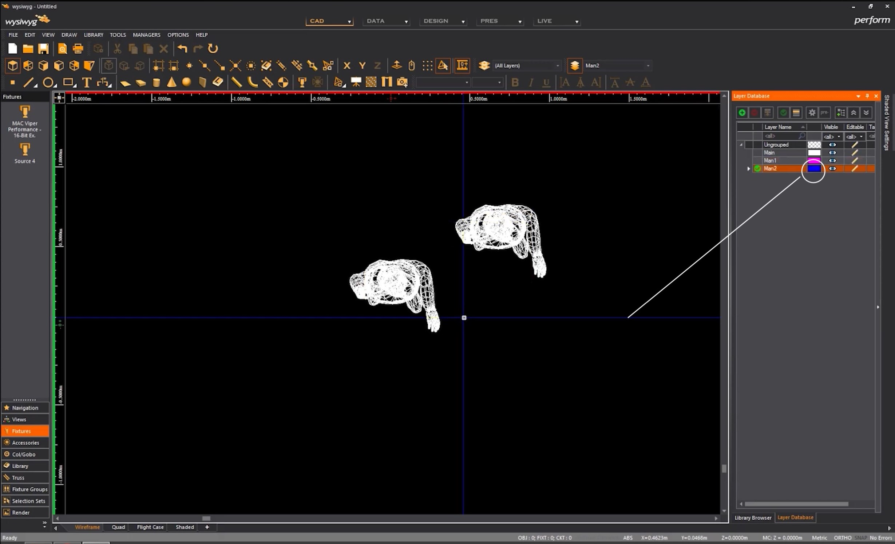

changer le calque de travail (ce n'est pas parce qu'un calque est sélectionné que l'on travaille dessus)

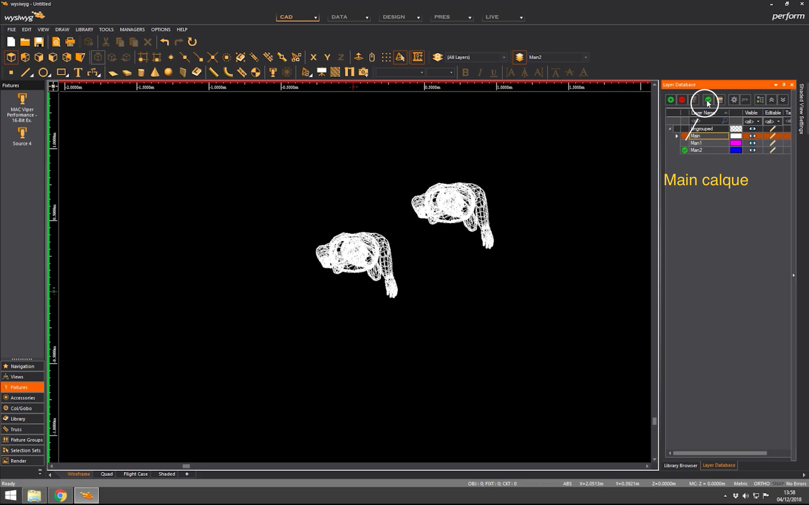
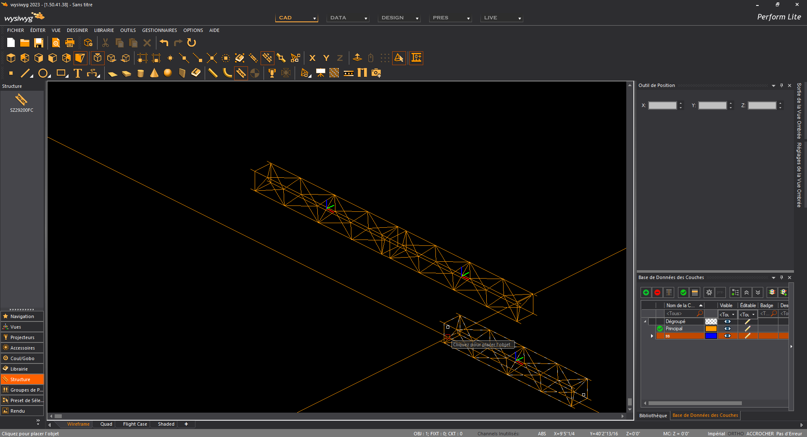
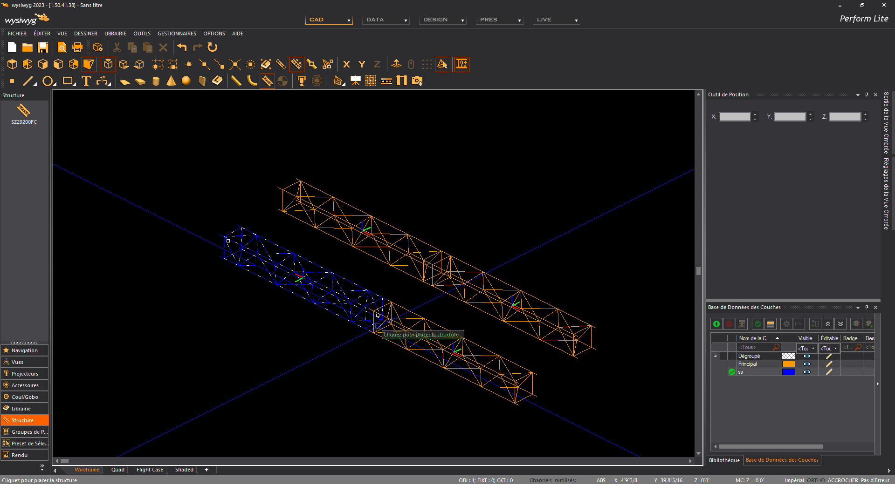

impossible de cacher le calque de travail

Bloquer un calque

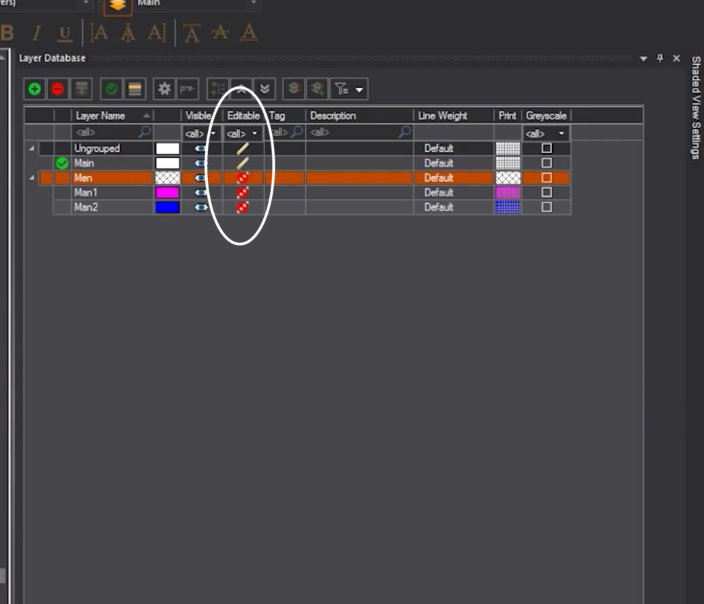

## Changer un objet de calque

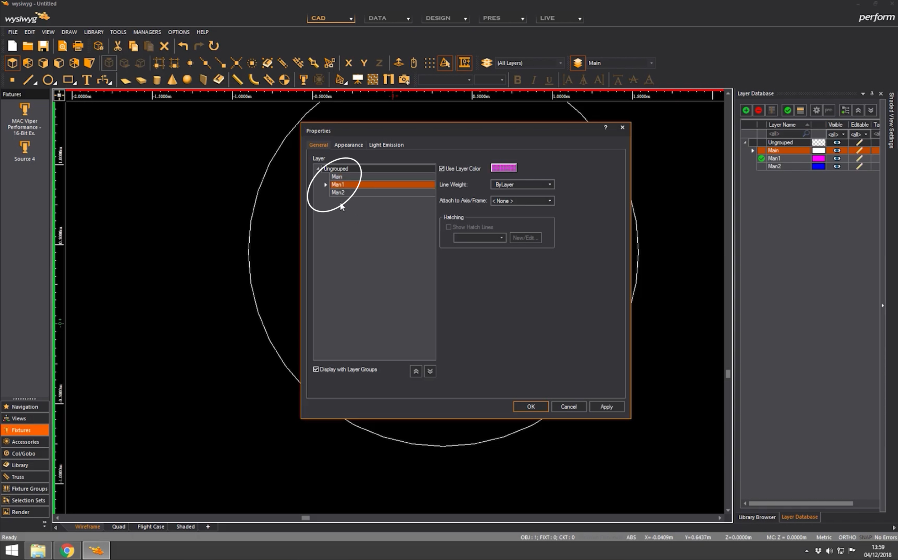

## grouper les calques
sélectionner les calques
et appuyer sur le bouton grouper

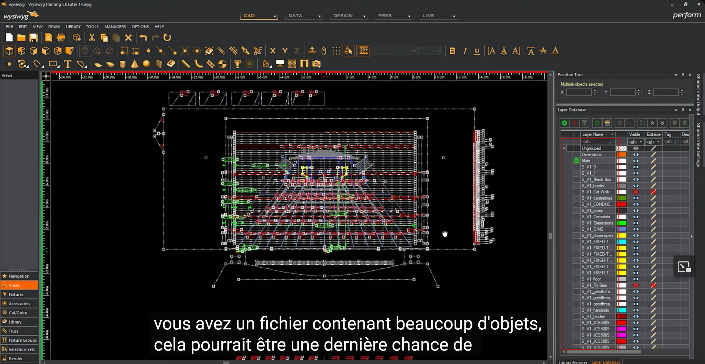

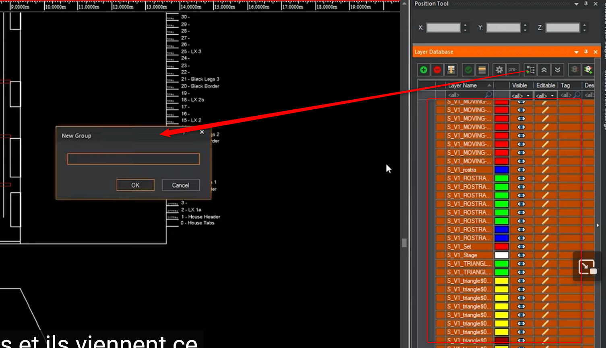

