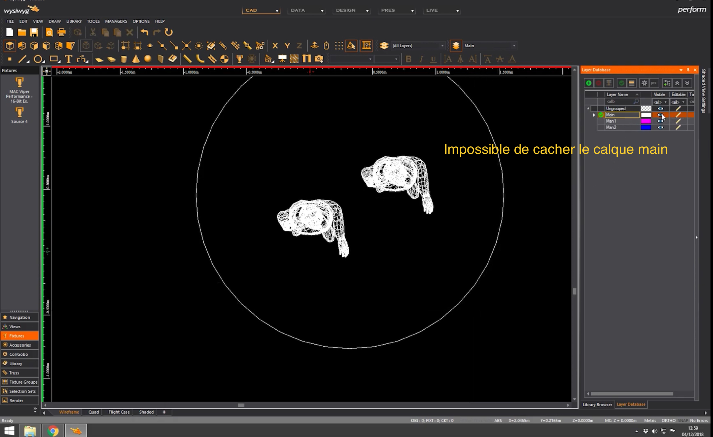
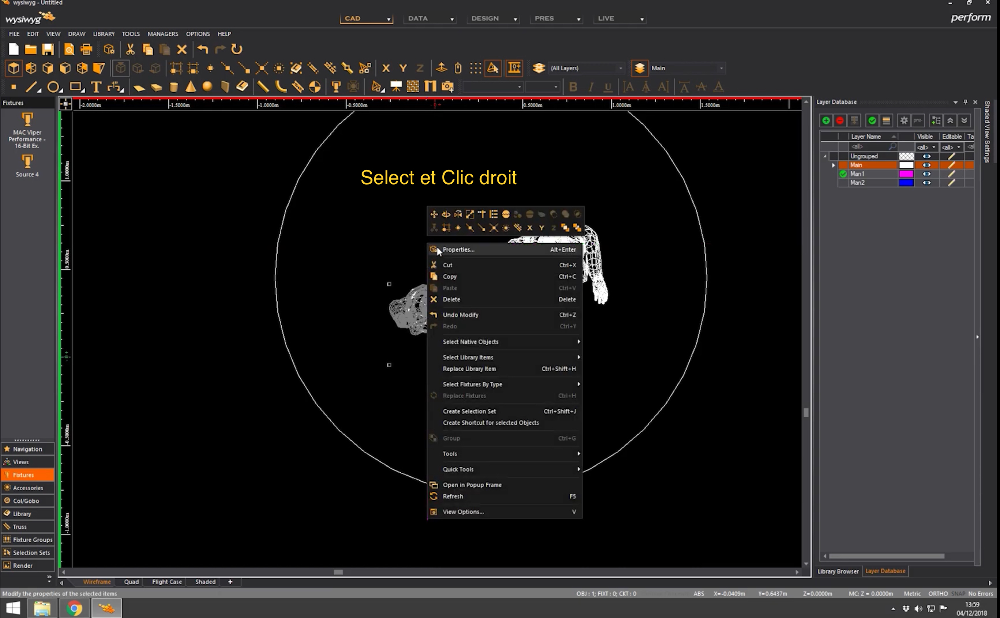

# Les calques

## Afficher les calques

Changer la couleur de la croix pour savoir sur quel calque on travail

Rendre le calque principal

Bloquer un calque

## Changer un objet de calque

## grouper les calques
sélectionner les calques
et appuyer sur le bouton grouper

