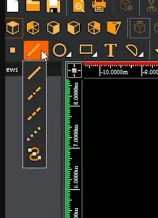
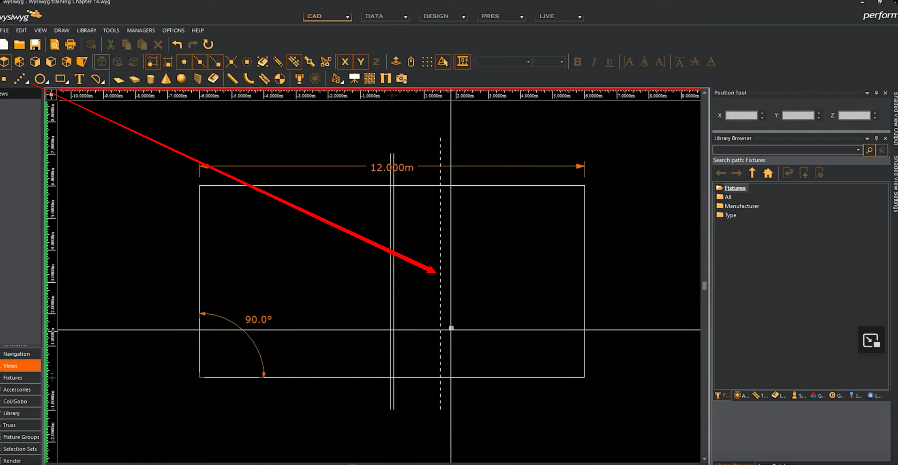
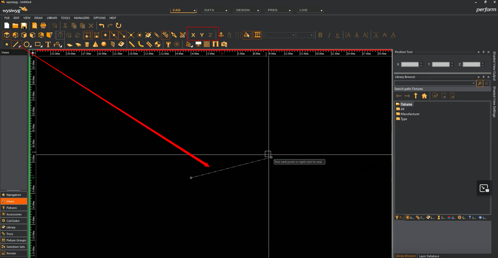
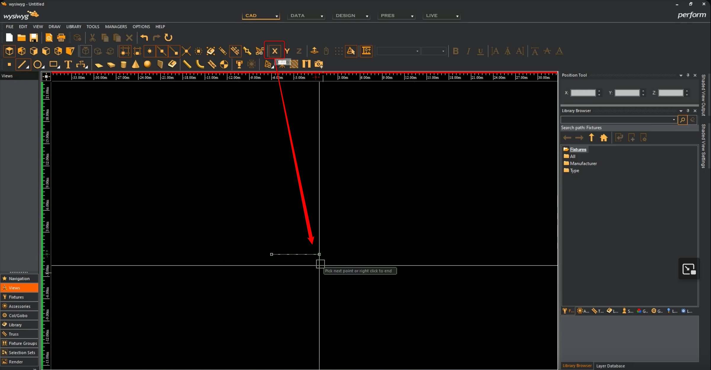
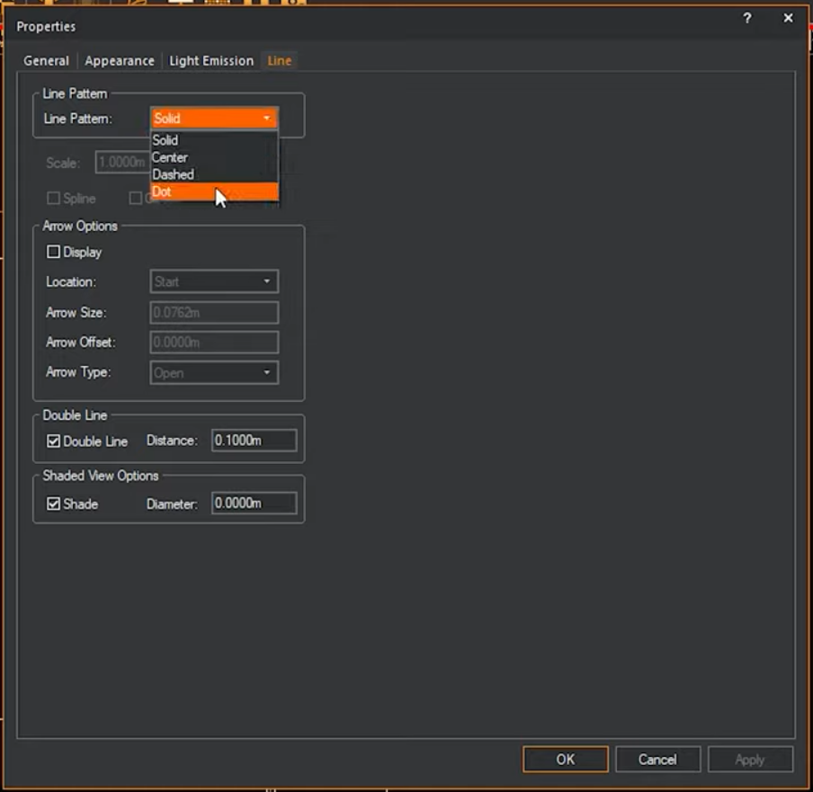
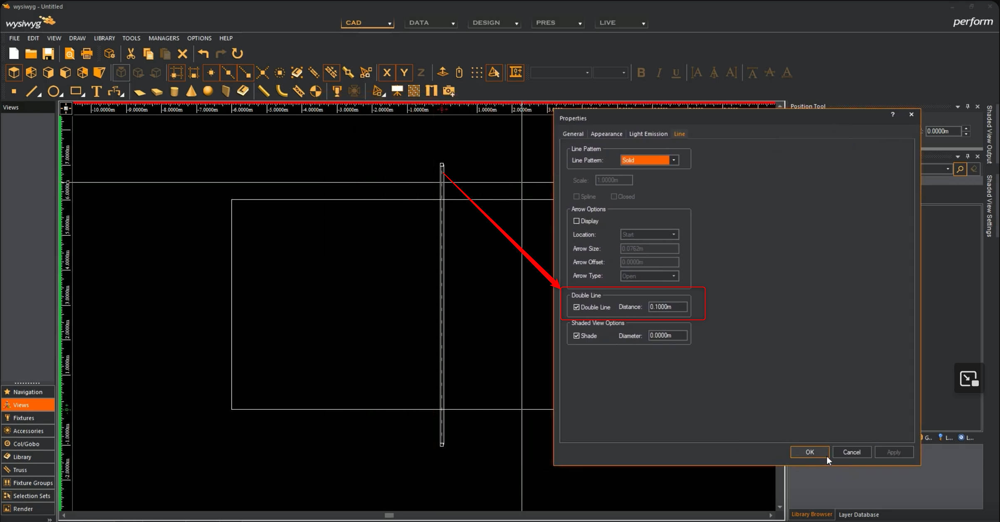
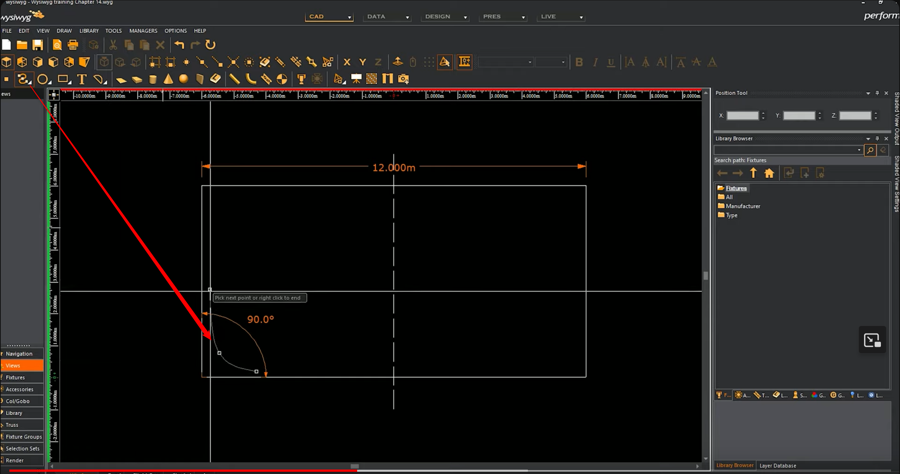
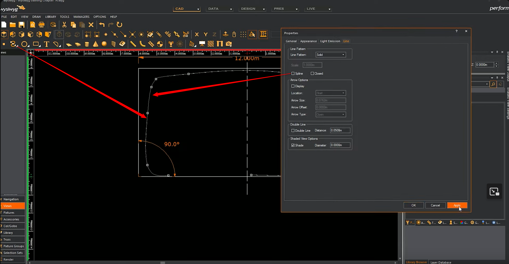
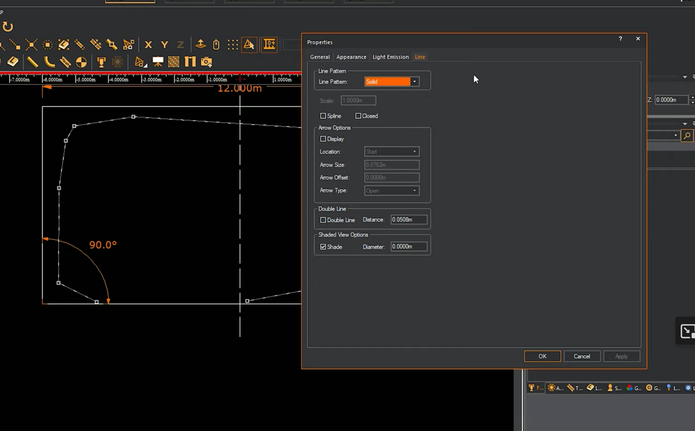
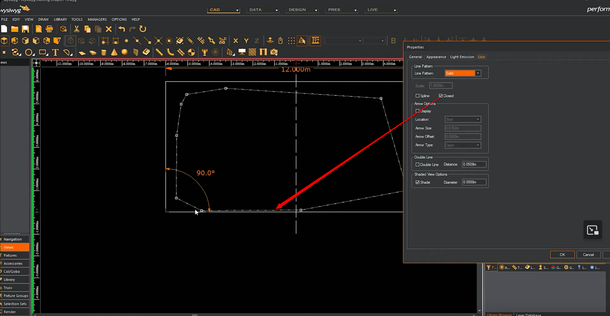

# Créer des lignes

Bloquer les axes si besoin

Finir une ligne avec le clic droit

propriétés pour changer le style de ligne

Pour faire une courbe

et changer le mode de courbe (arrondi ou non)

ou fermer une courbe

