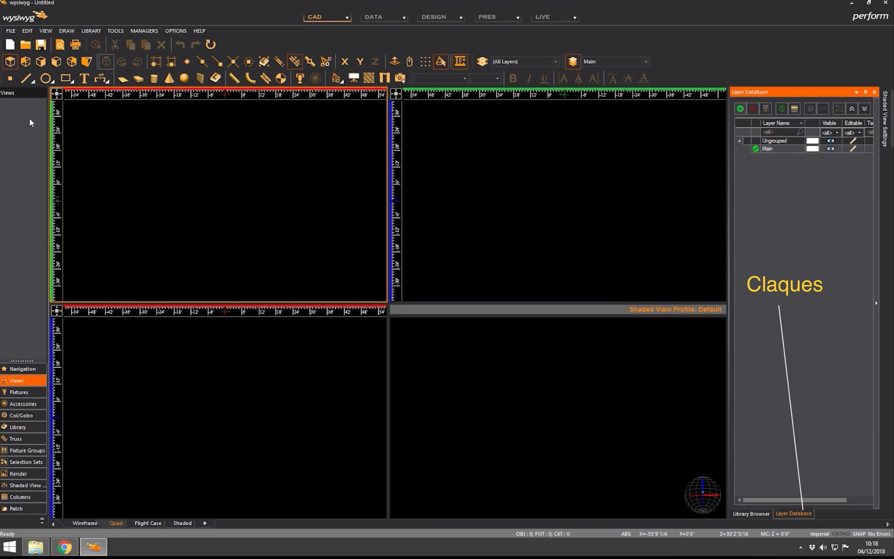

# Mode CAD

## Afficher les calques

## Afficher la librairie

double clic pour mettre un objet dans la fenetre de travail

Clic droit pour voir les options

## options du document

Couleur de fond

Pas de grille et inclinaison de la vue

dessiner une grille

## options de l'application

ouvrir le dernier fichier

## option d'un objet

Adresse DMX, mode...

rotation d'un objet

miroir

sélectionner tous les objets identiques

## Option d'une vue

## Ajouter un objet dans nos favoris (liste de travail)
### ajouter une fixture

### ajouter un accessoire

### ajouter un filtre de gélatine

## Ajouter un objet 3D

l'option interactive permet de faire une forme à la souris et non en entrant les dimensions à la main

## créer des groupes de produits habituels

## sélection de produit l'un au dessus de l'autre
avec la touche shift

