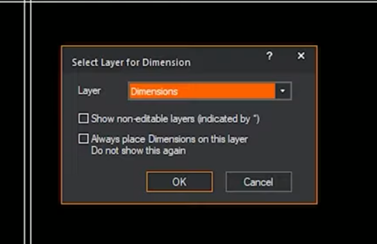

# Les mesures

Choisir son outil

Il propose de mettre les mesures sur un nouveau calque

Cliquez sur les 2 points pour afficher la mesure

## Les angles

Cliquez sur les 2 lignes adjacentes pour afficher un angle

