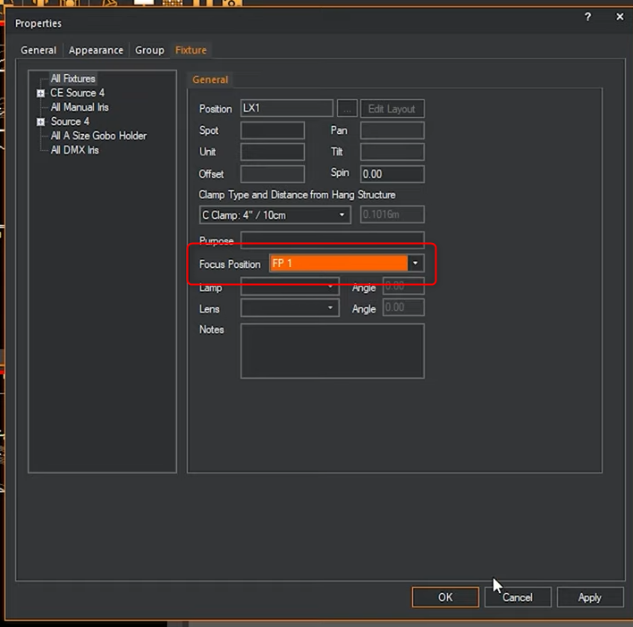
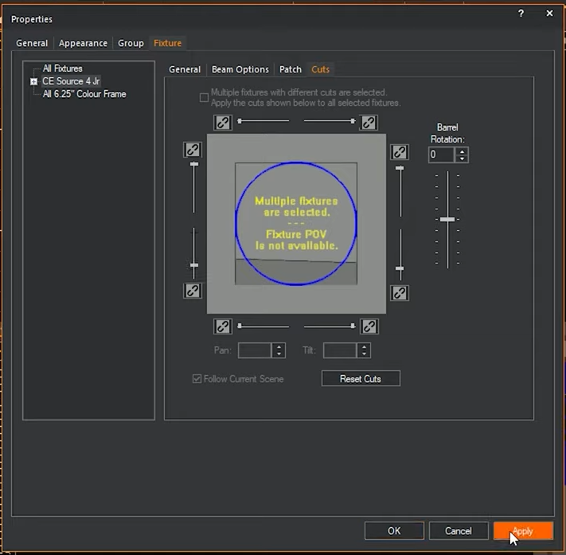

# les projecteurs

## adressage
adresser automatiquement avec incrémentation au clic

clic droit dans le vide

dès que l'on clic sur un produit ça incrémente automatiquement

clic droit

## rotation

## gobo sur mesure

ajouter le gobo dans les accessoires

## préparer un liste de gobo ou de couleur type

et la mettre en place dans l'option de l'appareil

## faire un groupe de fixture

## focus

Faire le focus d'une lyre

Faire le focus d'un projecteur non motorisé (uniquement en mode CAD)

### préparer un point de focus

et le mettre dans les appareils

## mettre un couteau dans une découpe

## créer un projecteur ou un appareil qui sera installé sur la structure

