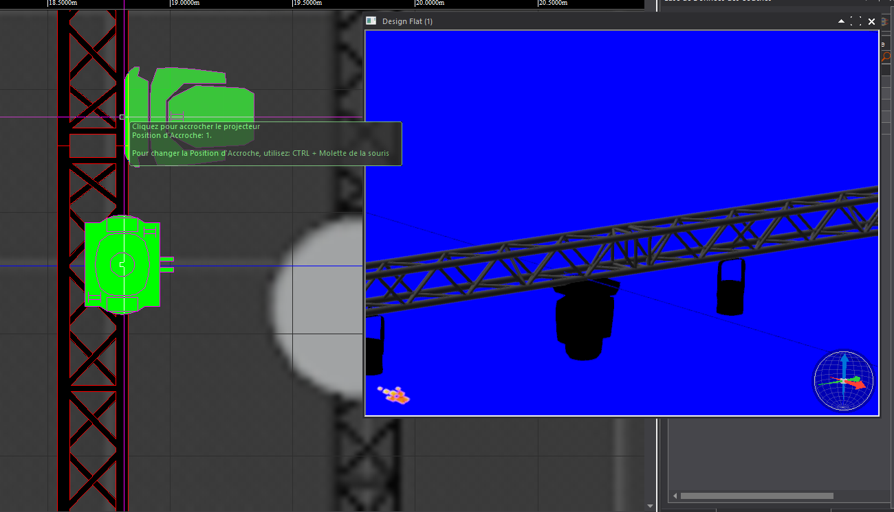
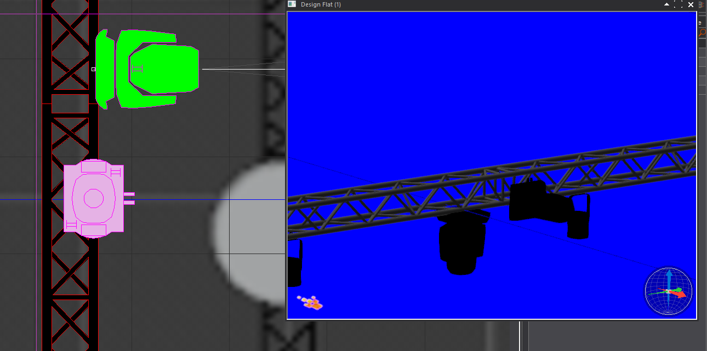
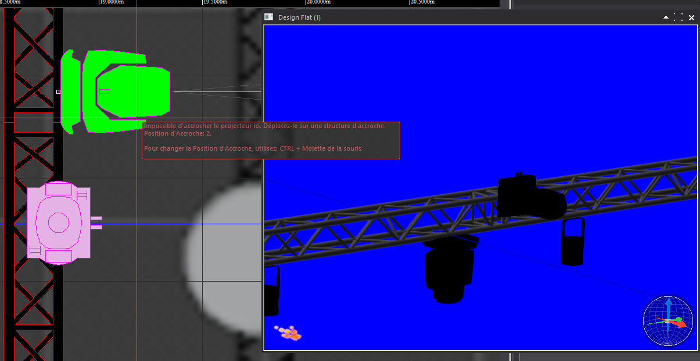
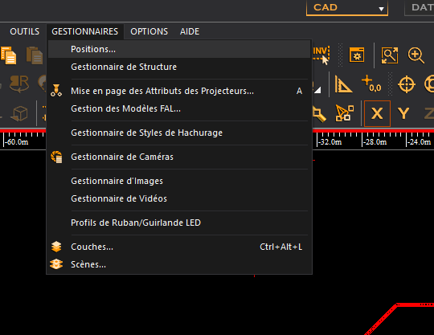
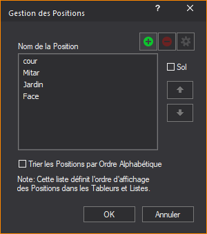
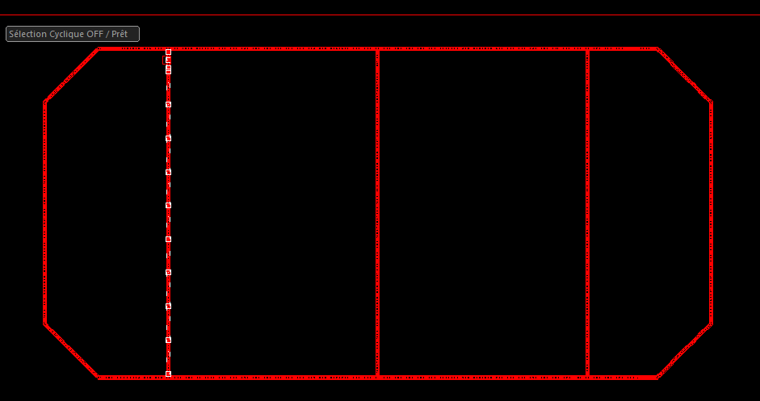
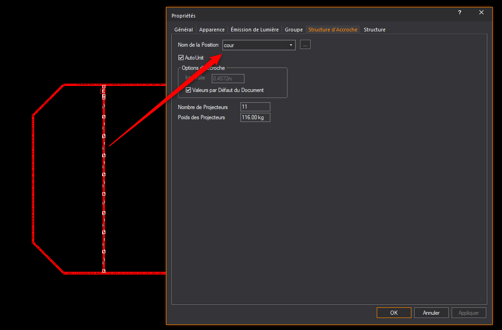

# pipe

### mettre des pieds à un tube

## nommer les perches

## installer un appareil au sol
intégrer un floater avant

ou faire un clic droit pour mettre au sol

## sens de la structure

on voit ici que l'axe rouge/vert change si on empile coté gauche la structure

donc les lyres seront inversées

pour résoudre, il faut changer le montant à la pose de la structure ou alors empiler à droite

faire de meme pour les angles

## accrocher sur un tube et tourner un projecteur

spin 90°

position 2

position 1

## colorer les structures

GEstionnaires / truss manager

## reassembler les structure
ne pas grouper les structures, mais plutot reassembler la structure

## position ou nom de perche
attriber des noms de perches à vos assemblages de structure

