# pipe

### mettre des pieds à un tube
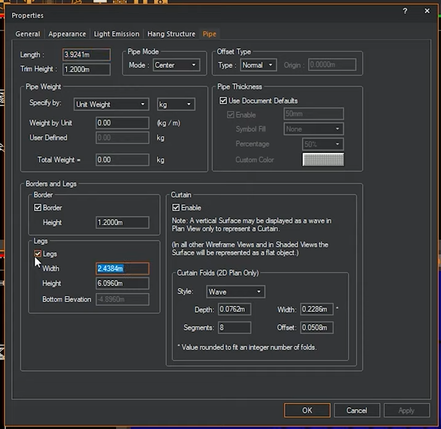
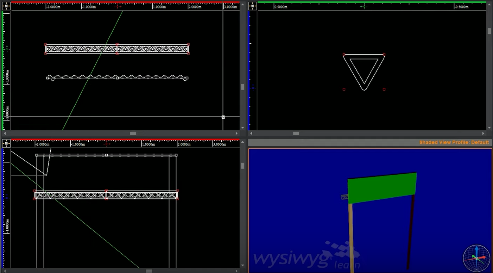

## nommer les perches

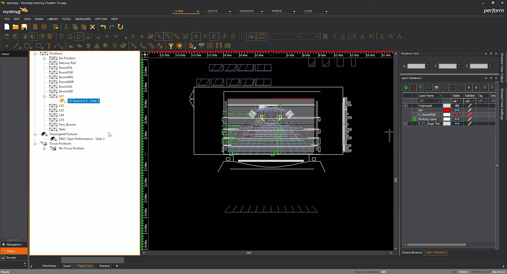

## installer un appareil au sol
intégrer un floater avant
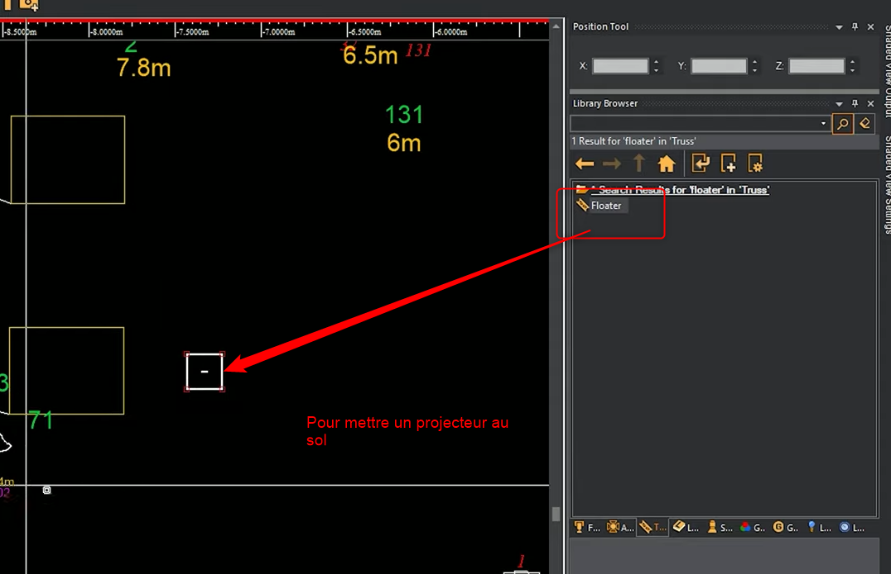

ou faire un clic droit pour mettre au sol

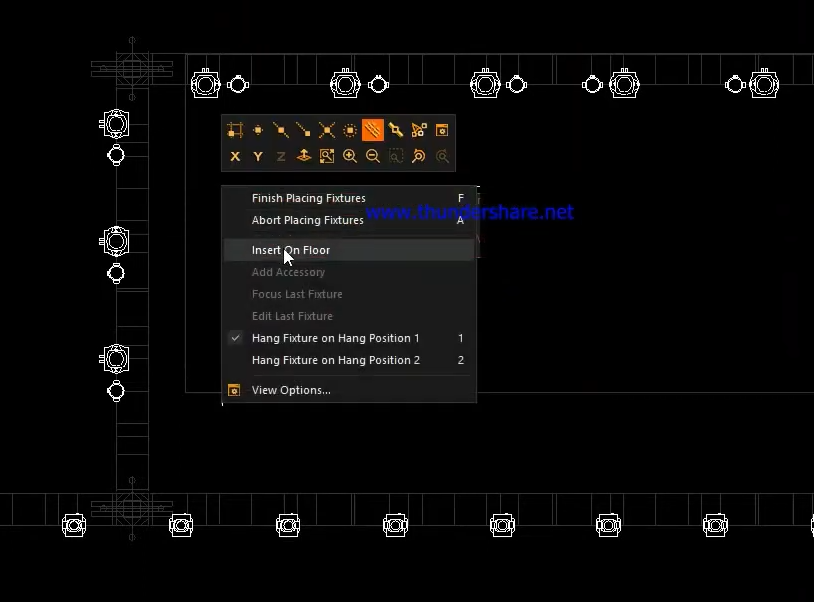

## sens de la structure autour de l'axe médian

on voit ici que l'axe rouge/vert change
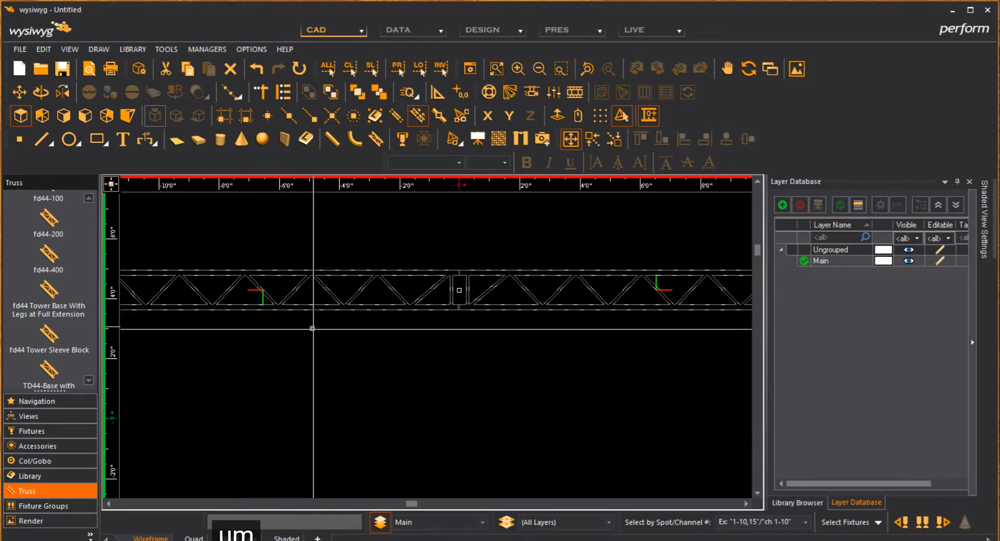

donc les lyres seront inversées

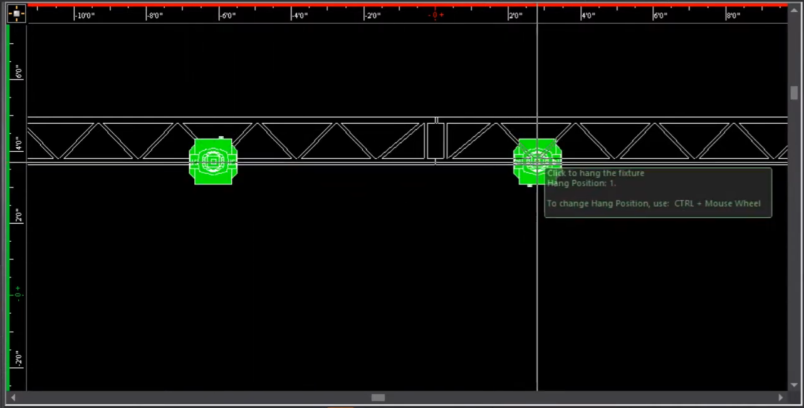

pour résoudre, il faut changer le montant à la pose de la structure

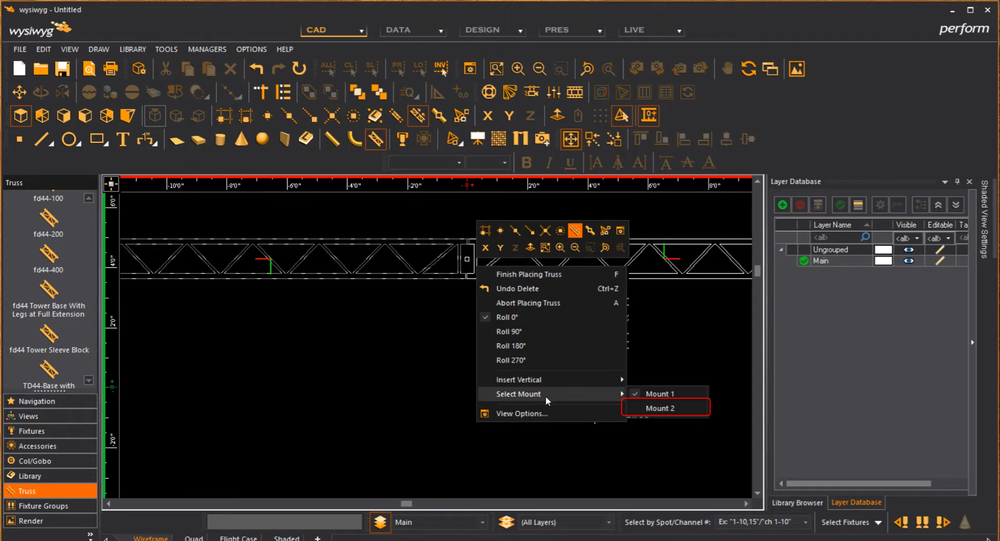
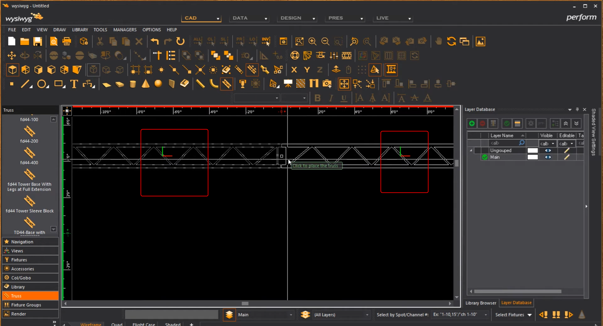
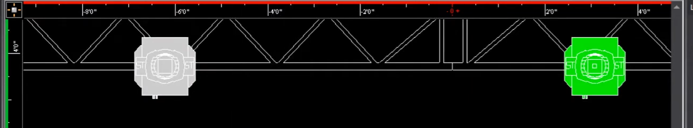

faire de meme pour les angles
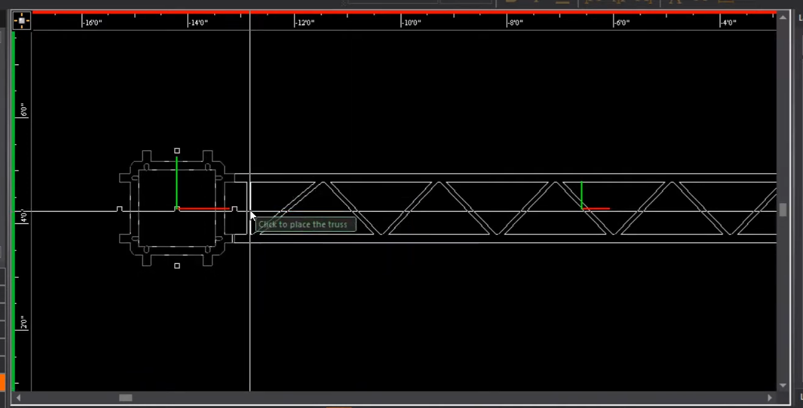
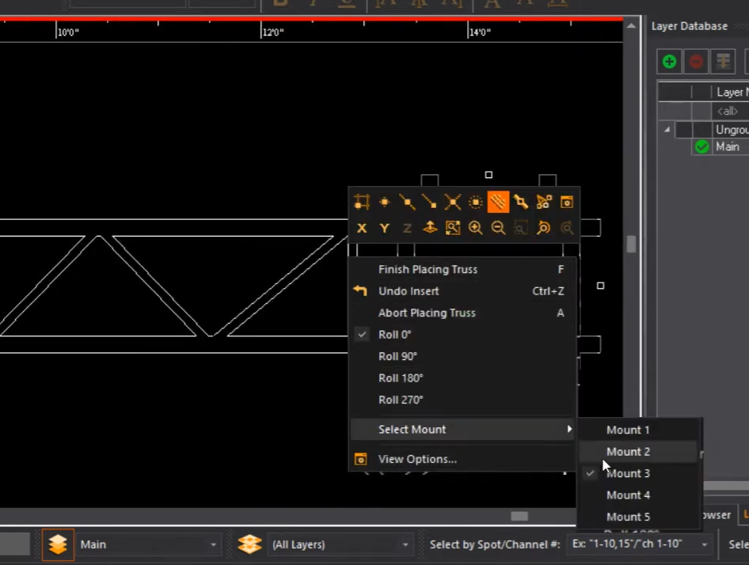

## tourner un projecteur
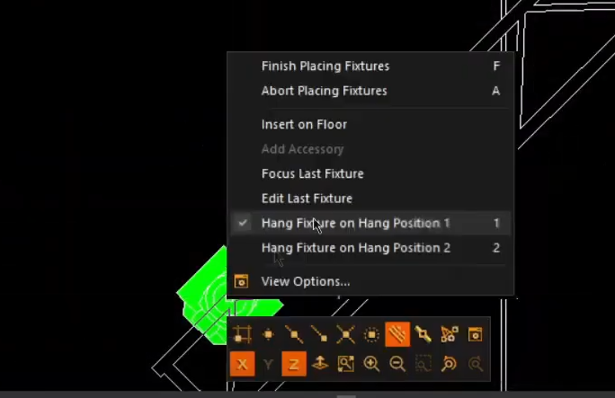
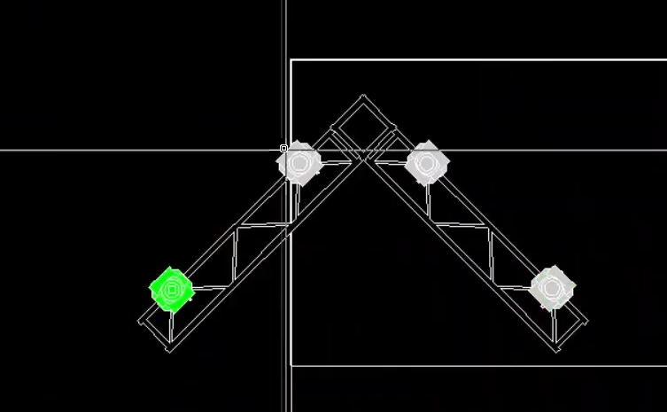
spin 90°
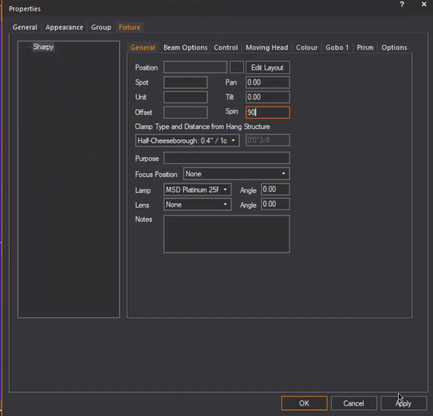
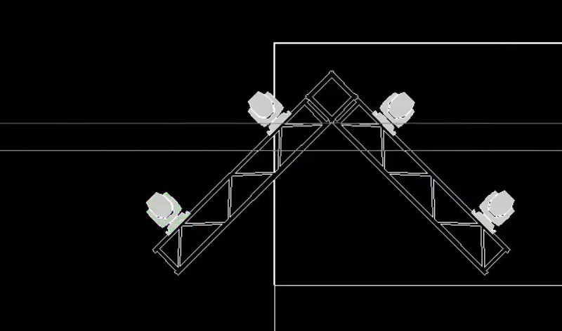

## colorer les structures

GEstionnaires / truss manager
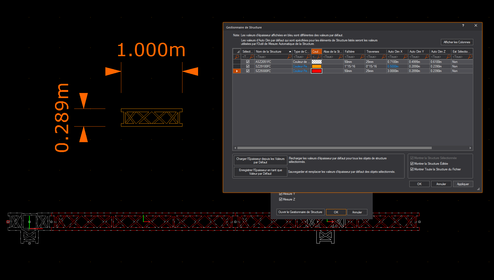

## reassembler les structure
ne pas grouper les structures, mais plutot reassembler la structure

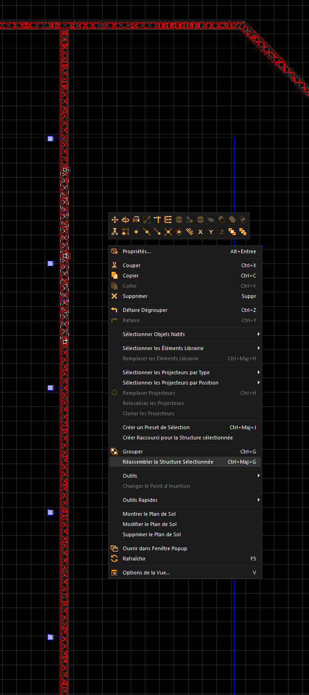

