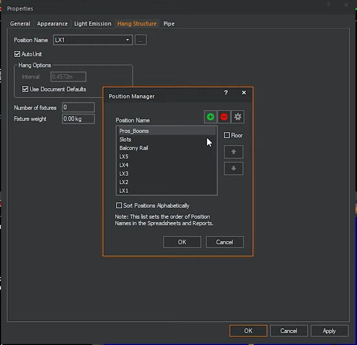
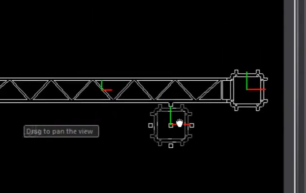

# pipe

### mettre des pieds à un tube

## nommer les perches

## installer un appareil au sol
intégrer un floater avant

ou faire un clic droit pour mettre au sol

## sens de la structure autour de l'axe médian

on voit ici que l'axe rouge/vert change

donc les lyres seront inversées

pour résoudre, il faut changer le montant à la pose de la structure

faire de meme pour les angles

## tourner un projecteur

spin 90°

## colorer les structures

GEstionnaires / truss manager

## reassembler les structure
ne pas grouper les structures, mais plutot reassembler la structure

