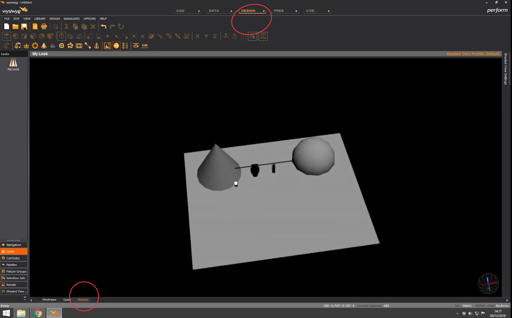
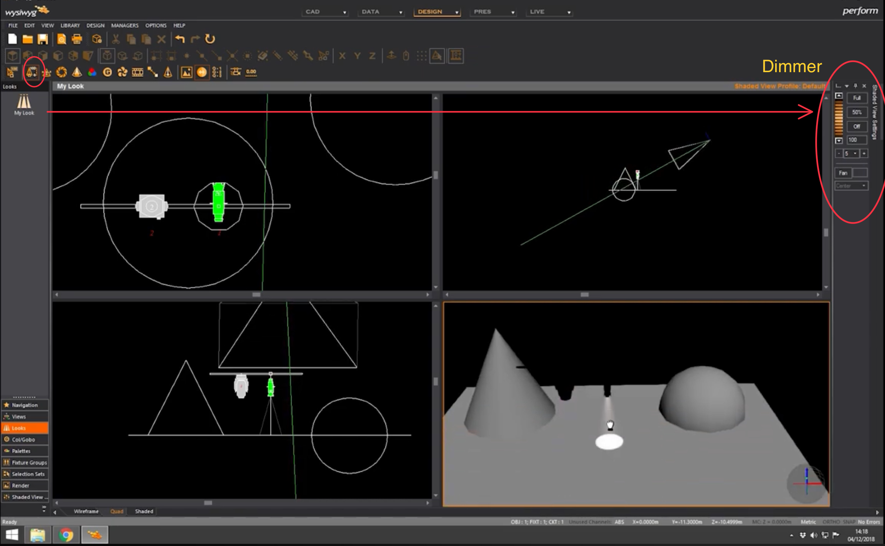
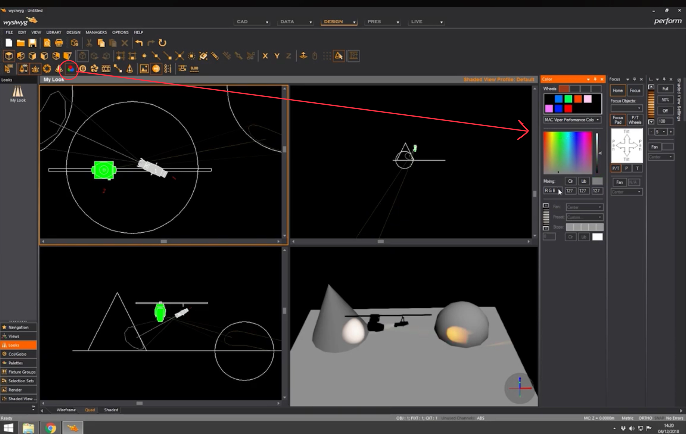
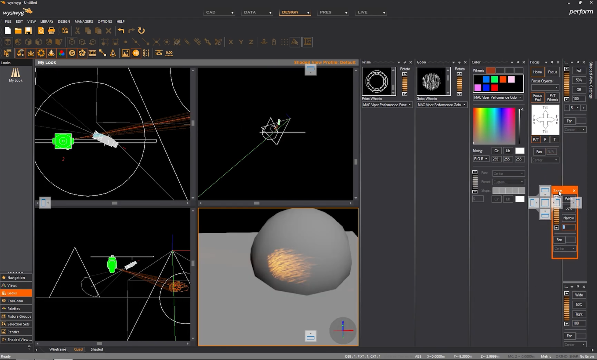
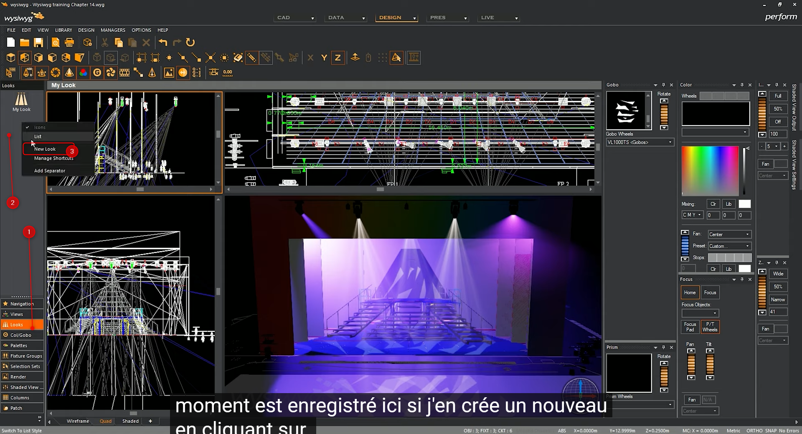
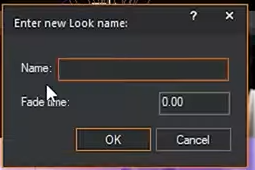

# Mode Design

Allumer un projecteur

Faire le focus d'une lyre

régler le dimmer

régler la couleur

déplacer les potards

Faire le focus d'un projecteur non motorisé (uniquement en mode CAD)

## enregistrer un design

