# Mode Pres

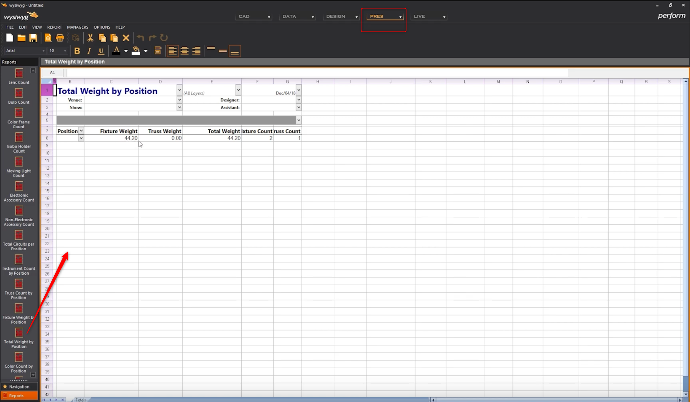
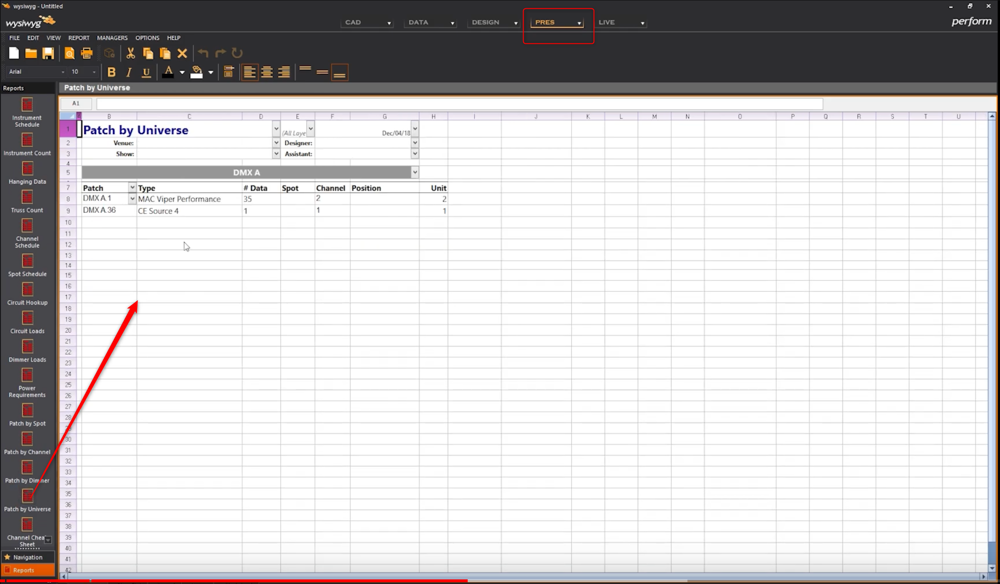

Ajouter des notes

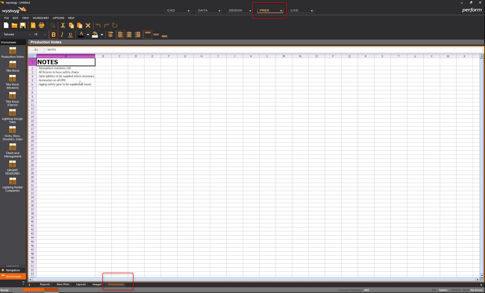

## layout

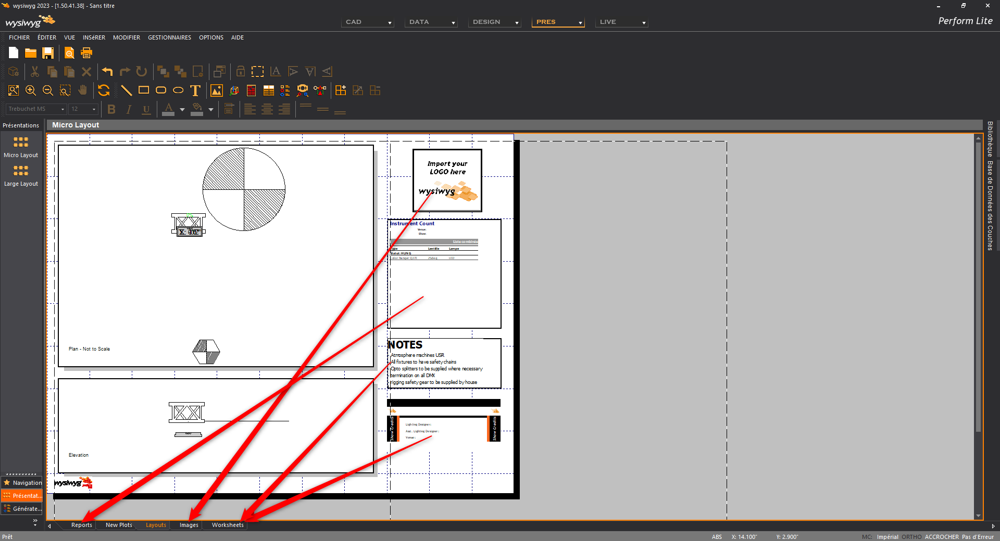

modifier le dessin choisi en prenant la scène

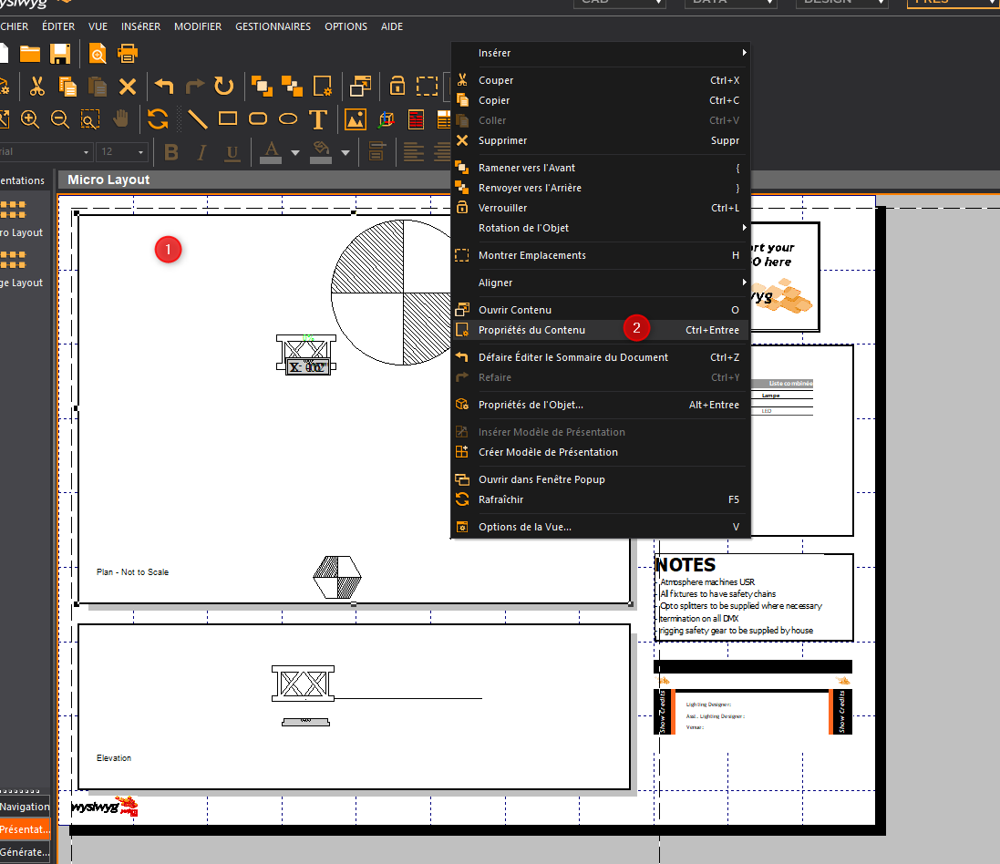
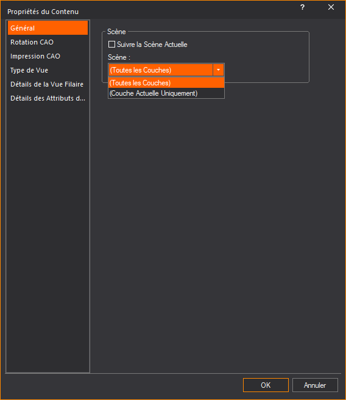

## worksheet
pour remplir les worksheet, pensez à sélectionner vos champs favoris puis les remplir

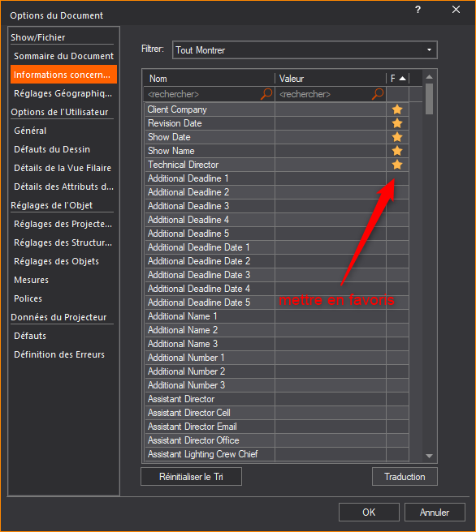

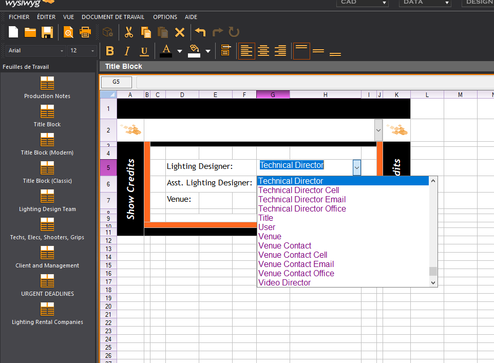

## plot
permet d'ajouter des symboles sans qu'ils apparaissent dans le CAD

et de l'insérer dans un layout

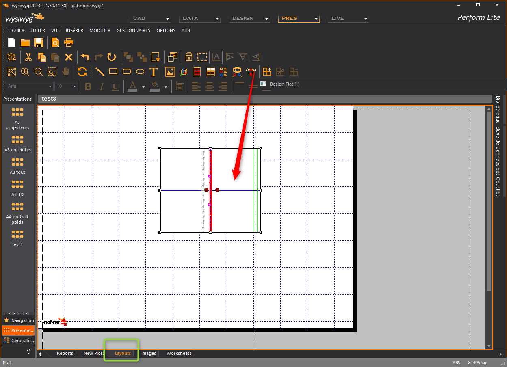

## légende
créer vos légendes puis les glisser dans le layout

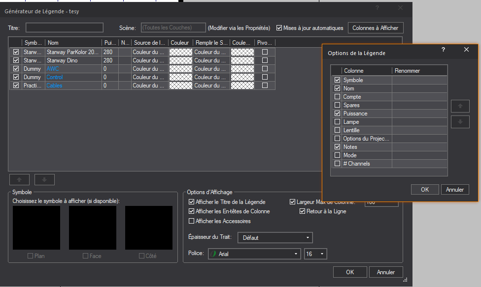
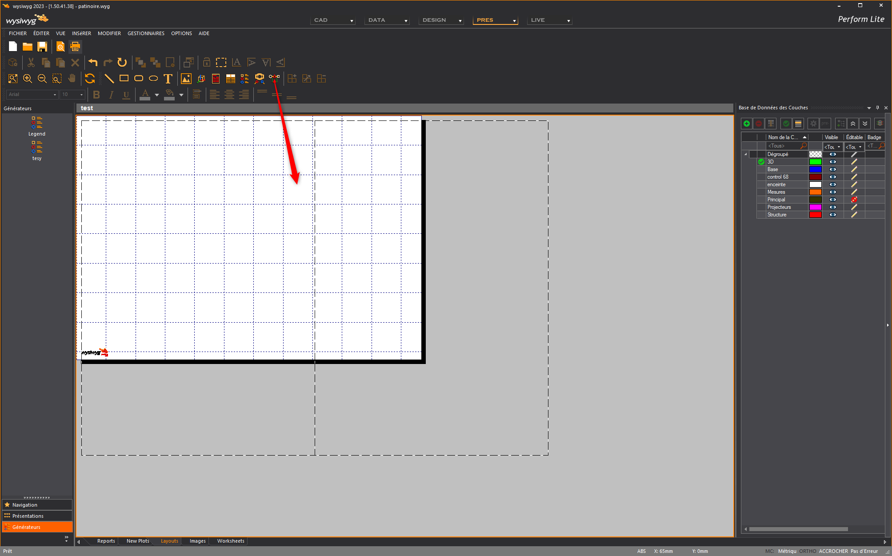

## clé
permet d'afficher une explications des données imprimées

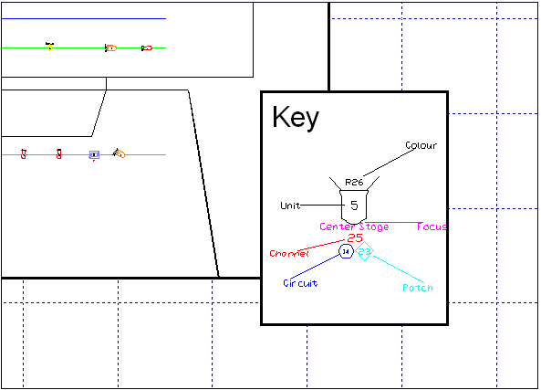
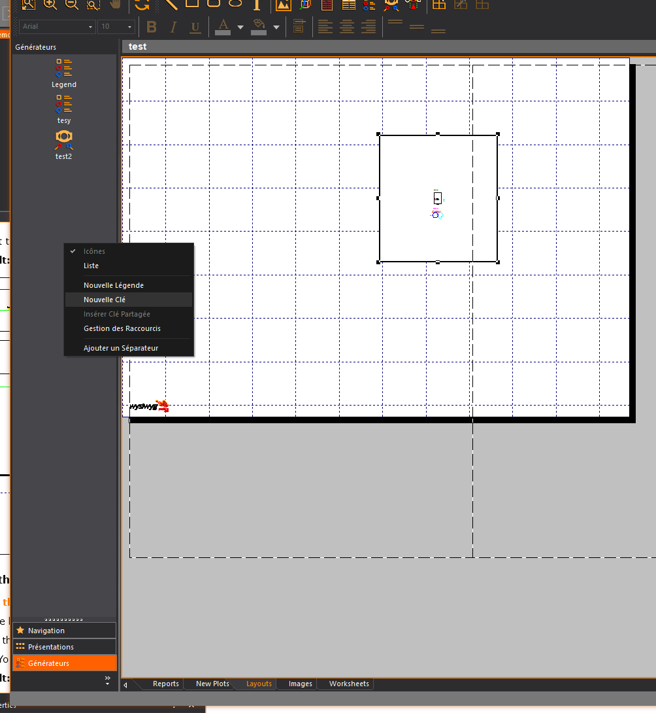