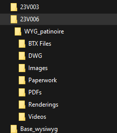
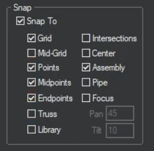
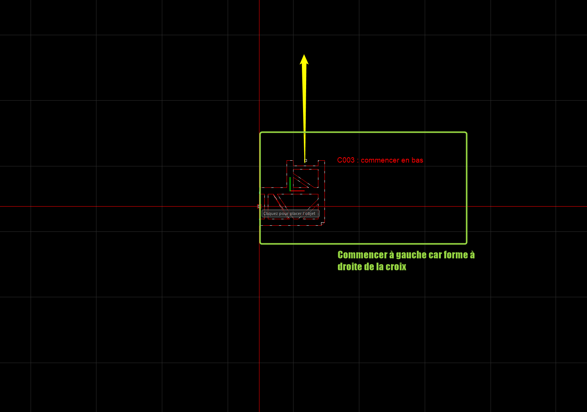

# Tutoriel Wysiwyg

1. enregistrer votre projet directement sans dossier. appelez votre projet WYG_nom de projet

2. Choisir les unités

3. Aller dans les options du document pour changer la taille de grille

4. Modifier le snap

5. créer un calque, le mettre en main, et dessiner les axes medians pour repères

Ajouter la liste calque pour changer plus vite !

5. ou créer les mesures de repère

retirer le snap

6. dessiner un cadre pour les dimensions exterieures de votre grill

remettre le snap

6. mettre ses projecteurs et sa structure en favoris

Prolyte 
003 angle 2D 90° 50x50
016 croix 4D 71x71
012 pied 3D 50x50x50
017 T 71x50
020 T 4D 71x50x50
024 croix pied 71x71x50

7. enregistrer le projet

8. ce mettre en vue du dessus, dans le bon calque 
pour snaper la structure mieux vaut activer que le snap truss

9. vérifier la position de base de votre angle principal.

**commencer la structure à gauche**

**commencer la structure en haut si l'angle part vers le bas**

**pour le C003 prolyte, commencer en bas à gauche**

9. mettre en place la structure sur les axes

10. placer les projecteurs

Attention au placement des prises

et au montant utilisé. travailler avec la fenetre 3D

11. orienter les projecteurs

